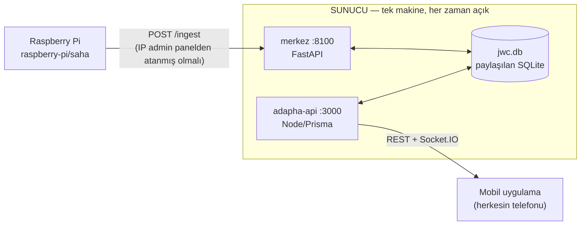
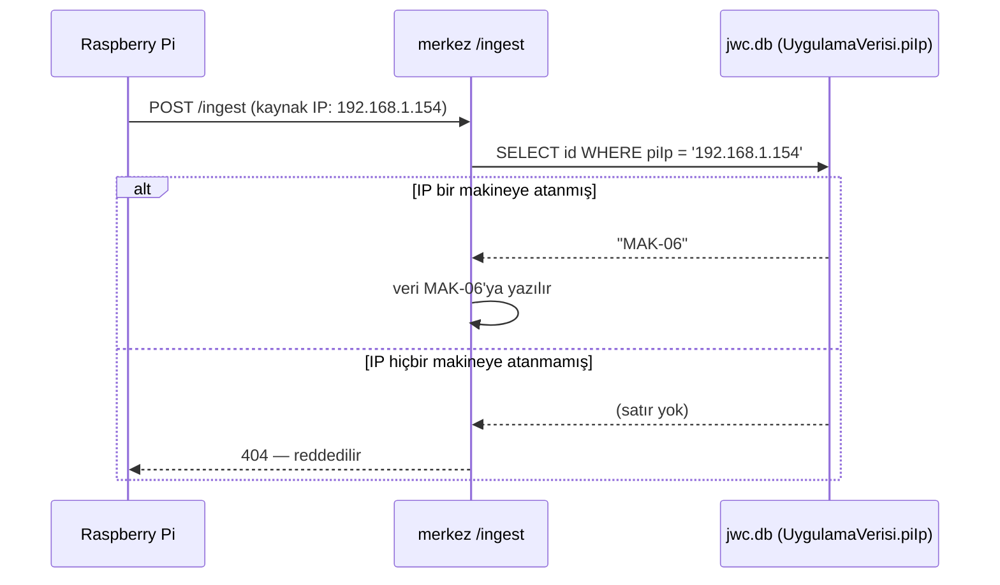

# JWC / C-OBServer — Kurulum Rehberi

Sistemi sıfırdan ayağa kaldırmak için tek başvuru dosyası. İki ayrı parça
var: **Raspberry Pi** (fabrika sahasında, makine başına bir tane) ve
**sunucu** (merkez API + adapha-api + veritabanı, tek yerde, her zaman
açık). Mobil uygulama bu sunucuya bağlanır.



Veritabanı şemasının (6 tablo, kim neyi yönetiyor) ayrıntısı için bkz.
kök `README.md` → "Veritabanı" bölümü.

Tek depo (`github.com/ata-dmrl/C-OBServer`), üç ana klasör:

| Konum | İçerik | Nereye gider |
|---|---|---|
| `jwc/` | merkez (FastAPI) | Sunucu |
| `raspberry-pi/` | saha (Pi kodu) + arac (kalibrasyon) | Raspberry Pi |
| `adapha-rn/adapha-api/` | Node/Express/Prisma ara katman | Sunucu |
| `adapha-rn/adapha-rn/` | React Native mobil uygulama | Telefonlar (EAS build) |

---

## 1. Yerel geliştirme (Windows)

Depoyu klonladıktan, merkez + adapha-api bağımlılıklarını kurup `.env`
dosyalarını (bölüm 2) ayarladıktan sonra tek komutla başlatma/durdurma:

```bash
.\baslat.ps1
.\durdur.ps1
```

(Depo kökünden çalıştırın — tam yol da olur: `C:\yol\C-OBServer\baslat.ps1`.)

`baslat.ps1` merkezi, adapha-api'yi ve Expo'yu sırayla, ayrı pencerelerde
başlatır. Sıfırdan kurulum adımları aşağıdaki 3 ve 4. bölümlerle aynı —
tek fark sunucunun "bu bilgisayar" olması ve production ortam
değişkenleri yerine geliştirme varsayılanlarının kullanılması. Gerekli
kütüphanelerin kurulumu için 4.2 (merkez, Python) ve 4.3 (adapha-api,
Node) adımlarını uygulayın; Expo için `adapha-rn/adapha-rn` içinde
`npm install` yeterli.

---

## 2. Ön koşul: veritabanı yeri

Merkez ve adapha-api **aynı fiziksel SQLite dosyasını** paylaşır —
`jwc/data/jwc.db`. İkisinin de `.env` dosyasında `DATABASE_URL` bu
dosyayı **mutlak yol** ile göstermeli (göreli yol, SQLAlchemy ve
Prisma'da farklı dizinlere göre çözümlenip iki ayrı dosya oluşturuyor —
bu projede bir kere başımıza geldi).

```bash
# jwc/merkez/.env
DATABASE_URL=sqlite:////opt/C-OBServer/jwc/data/jwc.db      # Linux, mutlak yol
# adapha-rn/adapha-api/.env
DATABASE_URL="file:/opt/C-OBServer/jwc/data/jwc.db"
```

Klasör yapısı Windows'takiyle birebir aynı korunursa (`jwc/`,
`adapha-rn/` aynı üst klasörün altında) yolları uyarlamak yeterli.

**WAL checkpoint.** `jwc.db` yanında beliren `jwc.db-wal`/`jwc.db-shm`
dosyaları ayrı bir veritabanı değil, SQLite WAL modunun otomatik yardımcı
dosyaları. Her iki servis de kendi bağlantısında `wal_autocheckpoint`'i
kapatıp günde bir kez elle checkpoint alıyor (kod tarafında ayarlı,
ekstra kurulum gerekmez) — WAL dosyası gün içinde büyür ama bu veri
kaybı riski yaratmaz.

---

## 3. Raspberry Pi kurulumu

Ön koşul: hocanın verdiği `pi_capture_ocr` taban paketi Pi'de zaten
kurulu (GStreamer `tee`/passthrough, capture, dispatcher — bunlara hiç
dokunulmuyor). Bizim eklediğimiz kısım sadece 4 dosya.

### 3.1 Dosyaları yerleştir

```bash
cp raspberry-pi/saha/rapid_engine.py raspberry-pi/saha/ingest_bridge.py \
   raspberry-pi/saha/main.py ~/project/src/pi_capture_ocr/
cp raspberry-pi/saha/config.yaml ~/project/config/config.yaml   # eskisini yedekle!

cd ~/project && source .venv/bin/activate
pip install -r <(echo "rapidocr==3.9.1"; echo "onnxruntime")   # ya da raspberry-pi/saha/requirements.txt
pip install -e .
```

### 3.2 Kimlik ve merkez adresi

`/etc/default/pi-capture-ocr` — her Pi'de farklı olan **tek** dosya:

```bash
JWC_MACHINE_ID=MAK-01
JWC_API_URL=http://SUNUCU_IP:8100
```

**Önemli:** `JWC_MACHINE_ID`'nin artık pratik bir etkisi yok. Merkez,
isteğin geldiği IP'yi admin panelinde bir makineye atanmış IP'lerle
eşleştiriyor; eşleşme yoksa isteği tamamen reddediyor (Pi'nin bildirdiği
kimliğe bakılmıyor). Yine de dosyayı doldurun — ileride referans olarak
işe yarar ve bazı loglarda görünür.

```bash
sudo mkdir -p /etc/systemd/system/pi-capture-ocr.service.d
sudo tee /etc/systemd/system/pi-capture-ocr.service.d/override.conf <<'EOF'
[Service]
EnvironmentFile=-/etc/default/pi-capture-ocr
EOF
sudo systemctl daemon-reload && sudo systemctl restart pi-capture-ocr
```

### 3.3 Kalibrasyon

```bash
python -m pi_capture_ocr.main --preview-rois /tmp/onizleme.png
```

Kutular yanlışsa `config.yaml`'daki ROI koordinatlarını düzeltin.
`raspberry-pi/arac/capture_check.py` ile HDCP/format testi,
`raspberry-pi/arac/check_rois.py` ile kutuları görsel üzerine çizip
kontrol edebilirsiniz (bu araçlar Pi'de değil, geliştirme makinesinde
çalıştırılır — kalibrasyon karesini oradan alıp bilgisayara aktarın).

### 3.4 Admin panelinden bağlama (zorunlu adım)

Pi doğru çalışsa bile, **admin panelinden IP ataması yapılmadan hiçbir
veri merkeze kabul edilmez.** Mobil uygulama → Admin ekranı → ilgili
makine kartına Pi'nin IP'sini ve portunu (varsayılan `8090`) girin.
Anında etkin olur, servis yeniden başlatmaya gerek yok.

**IP alanına ne yazılır?** Pi'nin kendi IP'si (`ifconfig`/`ip addr` ile
görülen), Pi'deki *anlık görüntü sunucusunun* dinlediği port ile
birlikte (`saha/main.py` bunu ana API portunun +10'u olarak açar — ör.
API `:8080` ise anlık görüntü `:8090`). Merkez adresi (`JWC_API_URL`)
buraya **yazılmaz** — o ayrı, `/etc/default/pi-capture-ocr` içinde.

**Neden böyle?** Bir Pi fiziksel olarak başka bir hatta taşınınca
(`JWC_MACHINE_ID` değiştirilmeden), sadece admin panelinden IP'yi yeni
makineye atamak yeterli olsun diye:



Pi'nin kendi bildirdiği kimlik hiç kullanılmıyor — admin panelinde bu
IP'ye karşılık gelen bir makine yoksa istek doğrudan reddedilir.

---

## 4. Sunucu kurulumu (Linux, systemd ile)

Sunucu fabrika içi bir Linux makine/VM olabilir ya da bulutta bir VPS —
aşağıdaki adımlar ikisinde de aynı. Windows'ta çalıştırmak isterseniz
bölüm 4.6'ya bakın (zaten kurulu `baslat.ps1`/`durdur.ps1` mantığını
NSSM ile servise çevirmek yeterli).

### 4.1 Kodu sunucuya al

Tek depo, tek `git clone` — `jwc/`, `adapha-rn/` ve `raspberry-pi/`
hepsi aynı deponun içinde gelir:

```bash
sudo mkdir -p /opt && cd /opt
git clone https://github.com/ata-dmrl/C-OBServer.git
cd C-OBServer
mkdir -p jwc/data
```

`raspberry-pi/` klasörünü sunucuya kurmaya gerek **yok** — o sadece
Pi'ye kopyalanır (bkz. bölüm 3), sunucuda hiç kullanılmaz.

### 4.2 merkez (FastAPI, port 8100)

```bash
cd /opt/C-OBServer/jwc/merkez
python3 -m venv .venv && source .venv/bin/activate
pip install -r requirements.txt

cat > .env <<'EOF'
DATABASE_URL=sqlite:////opt/C-OBServer/jwc/data/jwc.db
EOF
```

Sistemli servis:

```ini
# /etc/systemd/system/jwc-merkez.service
[Unit]
Description=JWC Merkez API
After=network.target

[Service]
User=jwc
WorkingDirectory=/opt/C-OBServer/jwc/merkez
ExecStart=/opt/C-OBServer/jwc/merkez/.venv/bin/uvicorn api:app --host 0.0.0.0 --port 8100
Restart=on-failure
RestartSec=3

[Install]
WantedBy=multi-user.target
```

```bash
sudo systemctl daemon-reload
sudo systemctl enable --now jwc-merkez
```

### 4.3 adapha-api (Node/Express/Prisma, port 3000)

```bash
cd /opt/C-OBServer/adapha-rn/adapha-api
npm ci
cat > .env <<'EOF'
DATABASE_URL="file:/opt/C-OBServer/jwc/data/jwc.db"
MERKEZ_URL=http://127.0.0.1:8100
PORT=3000
EOF
npx prisma generate
npm run build        # tsc -> dist/
```

```ini
# /etc/systemd/system/jwc-adapha-api.service
[Unit]
Description=adapha-api
After=network.target jwc-merkez.service

[Service]
User=jwc
WorkingDirectory=/opt/C-OBServer/adapha-rn/adapha-api
ExecStart=/usr/bin/node dist/index.js
Restart=on-failure
RestartSec=3
Environment=NODE_ENV=production

[Install]
WantedBy=multi-user.target
```

```bash
sudo systemctl daemon-reload
sudo systemctl enable --now jwc-adapha-api
```

### 4.4 Güvenlik duvarı / erişim

Pi'lerin merkeze (`:8100`), telefonların adapha-api'ye (`:3000`)
ulaşabilmesi gerekir:

```bash
sudo ufw allow 8100/tcp   # merkez — sadece fabrika iç ağından erişilsin
sudo ufw allow 3000/tcp   # adapha-api — mobil uygulamanın eriştiği port
```

İnternete açık bir sunucuysa `:3000`'i doğrudan açmak yerine nginx ile
ters proxy + HTTPS (Let's Encrypt) önerilir — özellikle Expo'nun
production build'i genelde `http://` değil `https://` bekler:

```nginx
server {
    listen 443 ssl;
    server_name jwc.orneksirket.com;
    location / {
        proxy_pass http://127.0.0.1:3000;
        proxy_set_header Upgrade $http_upgrade;   # Socket.IO icin sart
        proxy_set_header Connection "upgrade";
        proxy_http_version 1.1;
    }
}
```

`:8100` (merkez) internete hiç açılmamalı — sadece Pi'lerin bulunduğu iç
ağdan erişilebilir olmalı; kimlik doğrulaması yok (bkz. `jwc/README.md`
→ Bilinen eksikler).

### 4.5 Mobil uygulamayı yeni sunucuya bağlama

`adapha-rn/adapha-rn/app.json` → `expo.extra.serverUrl` alanını yeni
sunucu adresine çevirin (nginx/HTTPS kullanıyorsanız `https://...`):

```json
"extra": { "serverUrl": "https://jwc.orneksirket.com" }
```

Sonra EAS ile gerçek bir build alın (Expo Go'yla sınırlı kalmadan,
telefonlara kurulabilir bir uygulama):

```bash
cd adapha-rn/adapha-rn
npx eas build --platform android --profile preview
```

Adres değiştiğinde APK'nın yeniden derlenmesi gerekir — şu an
`serverUrl` derleme zamanında gömülüyor, çalışma zamanında
değiştirilemiyor (bkz. `jwc/belge/MOBIL-YAPILACAKLAR-2.md`'nin —artık
silinmiş— maddesi 4; ileride uygulama içi bir "sunucu adresi" ekranı
eklenirse bu kısıt kalkar).

### 4.6 Alternatif: Windows sunucu

Fabrikada zaten bir Windows makine varsa, kodu klonlayıp aynı
`baslat.ps1`'i kullanabilirsiniz — tek fark, makine yeniden açıldığında
otomatik başlaması için görev zamanlayıcıya (Task Scheduler) "oturum
açılışında çalıştır" kaydı eklemek, ya da [NSSM](https://nssm.cc/) ile
`baslat.ps1`'i gerçek bir Windows servisine çevirmek. `durdur.ps1`
portlara göre çalıştığı için hangi yöntemi seçerseniz seçin aynen işler.

### 4.7 Veritabanı yedeği

`jwc/data/jwc.db` tek dosya, tek nokta arızası. Basit bir cron yeterli:

```bash
# /etc/cron.d/jwc-backup
0 3 * * * jwc cp /opt/C-OBServer/jwc/data/jwc.db /opt/C-OBServer/yedek/jwc-$(date +\%Y\%m\%d).db
```

WAL modu açıkken (`jwc.db-wal`, `jwc.db-shm` dosyaları) düz `cp` bazen
tutarsız görüntü alabilir; daha güvenlisi `sqlite3 jwc.db ".backup yedek.db"`.

---

## 5. Kurulum sonrası kontrol listesi

- [ ] `curl http://SUNUCU_IP:8100/machines` → boş liste de olsa 200 dönüyor
- [ ] `curl http://SUNUCU_IP:3000/api/ping` → `{"status":"pong",...}`
- [ ] Admin panelinden bir makineye Pi IP'si atandı
- [ ] Pi'de `systemctl status pi-capture-ocr` aktif, loglarda `POST /ingest ... 200 OK` görünüyor
- [ ] Mobil uygulama açıldığında ilgili makine kartı canlı veri gösteriyor
- [ ] `jwc-merkez` ve `jwc-adapha-api` servisleri `enable`, sunucu yeniden başlayınca kendiliğinden ayağa kalkıyor

Yeni bir makine eklerken izlenecek adımlar için `jwc/README.md` →
"Yeni bir makine eklemek" bölümüne bakın.
