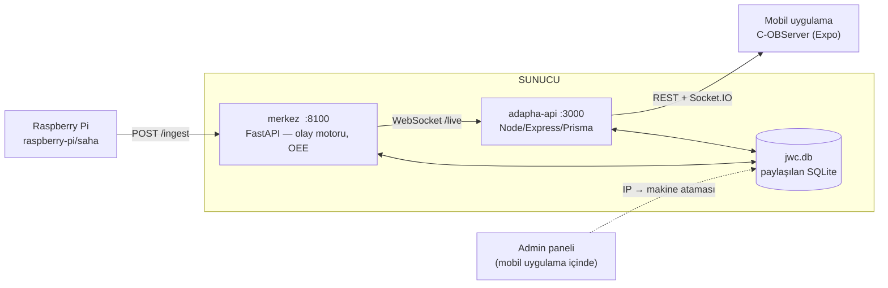
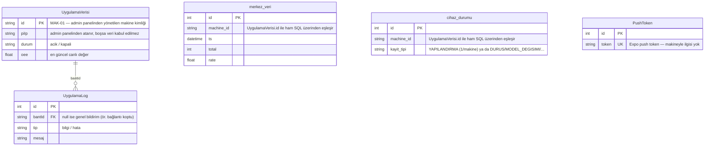

# C-OBServer

Kardağ Ltd. Şti. için geliştirilen fabrika hattı izleme sistemi.
Üretim makinelerinin ekranındaki canlı veriyi (HDMI üzerinden) otomatik
okuyup kalıcı kayda çevirir, duruş/kalite olaylarını tespit eder ve
mobil uygulamada canlı gösterir.

Bu dosya hızlı başlangıç ve genel harita içindir. **Sıfırdan kurulum —
hem Raspberry Pi hem sunucu, kütüphaneden servis dosyalarına kadar —
[`KURULUM.md`](KURULUM.md) içinde.**

---

## Mimari



Raspberry Pi, makinenin ekranını okuyup ham veriyi merkeze gönderir.
Merkez bu veriyi olaya çevirir (duruş, model değişimi, sayaç sıfırlanması,
kalite uyarısı) ve OEE hesaplar. adapha-api, mobil için Türkçe alan
adları ve bildirim geçmişi ekleyen ara katmandır. Merkez ve adapha-api
**aynı fiziksel SQLite dosyasını** (`jwc/data/jwc.db`) paylaşır — iki
ayrı veritabanı yok (ayrıntı: bölüm "Veritabanı" aşağıda).

**Kimliği admin paneli belirler, Pi değil.** Bir makineye admin
panelinden bir IP atanmadan o IP'den gelen veri kabul edilmez. Bir Pi
fiziksel olarak başka bir hatta taşınınca, Pi'nin kendi ayarına hiç
dokunmadan sadece admin panelinden IP'yi yeni makineye atamak yeterli.

---

## Depo yapısı

| Klasör | İçerik | Nereye kurulur |
|---|---|---|
| `jwc/merkez/` | FastAPI servisi — olay motoru, OEE, veritabanı, tarayıcı paneli | Sunucu |
| `jwc/belge/` | Merkez/mimari üzerine ayrıntılı teknik belgeler | (referans) |
| `adapha-rn/adapha-api/` | Node/Express/Prisma ara katman — mobil için REST + Socket.IO | Sunucu |
| `adapha-rn/adapha-rn/` | React Native (Expo) mobil uygulama | Telefonlar (EAS build) |
| `raspberry-pi/saha/` | Pi'nin taban paketine (`pi_capture_ocr`) eklenen 4 dosya | Raspberry Pi |
| `raspberry-pi/arac/` | Kalibrasyon, kıyaslama, test araçları | Geliştirme makinesi |

---

## Veritabanı

Tek dosya (`jwc/data/jwc.db`), **5 tablo** — 2'si Python/SQLAlchemy
(merkez), 3'ü Node/Prisma (adapha-api) tarafından yönetiliyor, ama
aynı fiziksel dosyada yaşadıkları için gerektiğinde birbirininkini de
ham SQL ile okuyabiliyorlar (ör. admin panelinin IP ataması,
`UygulamaVerisi.piIp`, merkezin `/ingest`'te kimlik tespiti için okuduğu
tablo).



| Tablo | Sahibi | Türü | Ne tutar |
|---|---|---|---|
| `merkez_veri` | merkez (Python) | **veri** | Ham okuma geçmişi — trend grafiği bunu okur |
| `cihaz_durumu` | merkez (Python) | **log** | `YAPILANDIRMA` satırı (makine başına 1, `stall_seconds` vb.) + duruş/model-değişimi/kalite-uyarısı olay geçmişi |
| `UygulamaVerisi` | adapha-api (Prisma) | **veri** | Her makinenin canlı durumu — mobilde görünen tüm sayılar, IP/port, kamera URL'i |
| `UygulamaLog` | adapha-api (Prisma) | **log** | Bildirim geçmişi (pasif/aktif geçişleri, bağlantı olayları) |
| `PushToken` | adapha-api (Prisma) | (kayıt) | Hangi telefona push bildirimi gönderileceği — makine/log verisiyle ilgisi yok |

Eskiden bir 6. tablo (`UygulamaTrend`) vardı — merkezin `/machines/{id}/samples`
ucundan HTTP ile çekilen veriyi ikinci kez saklıyordu. Aynı veri zaten
`merkez_veri`'de olduğu için kaldırıldı; grafik artık doğrudan oradan okunuyor.

**WAL modu ve checkpoint.** `jwc.db` yanında `jwc.db-wal`/`jwc.db-shm`
görülür — SQLite'ın WAL modunun otomatik yardımcı dosyaları (merkez ve
adapha-api aynı dosyaya eşzamanlı yazdığı için gerekli), ayrı bir
veritabanı kopyası değiller. `-wal`'in `jwc.db`'ye ne zaman birleşeceği
(checkpoint) **günde bir kez**e ayarlandı (`wal_autocheckpoint=0` + her
iki serviste de 24 saatlik zamanlayıcı) — WAL modu zaten çökme-güvenli
olduğu için bu, veri kaybı riski yaratmaz, sadece birleştirme sıklığını
değiştirir.

---

## Hızlı başlangıç (yerel geliştirme, Windows)

Bağımlılıklar kuruluysa (bkz. `KURULUM.md` bölüm 2–4.3) tüm sistem
tek komutla ayağa kalkar:

```bash
.\baslat.ps1
```

Merkezi (`:8100`), adapha-api'yi (`:3000`) ve Expo'yu (`:8081`) sırayla,
ayrı pencerelerde başlatır. Durdurmak için:

```bash
.\durdur.ps1
```

Portlara göre çalışır, hangi pencerelerin açık olduğuna bakmaz — güvenle
her zaman çalıştırılabilir.

**Gerekli ayar:** `jwc/merkez/.env` ve `adapha-rn/adapha-api/.env`
dosyalarındaki `DATABASE_URL`, ikisi de **aynı** `jwc/data/jwc.db`
dosyasını **mutlak yol** ile göstermeli. Ayrıntı için `KURULUM.md`
bölüm 2.

---

## Belgeler — hangisi ne işe yarar

| Dosya | Ne için | Kime |
|---|---|---|
| **`README.md`** (bu dosya) | Genel harita, hızlı başlangıç | Herkes, ilk okunacak |
| **`KURULUM.md`** | Sıfırdan kurulum — Pi + sunucu, kütüphaneler, systemd servisleri, güvenlik duvarı, mobil uygulamayı yeni sunucuya bağlama | Kurulum yapan kişi |
| `jwc/README.md` | Merkez'in kendi mimarisi, dosya dosya ne işe yaradığı, "yeni makine ekleme" adımları, bilinen eksikler | Merkez kodunu değiştirecek kişi |
| `jwc/belge/DURUM-RAPORU.md` | Projenin genel durum raporu — ne yapıldı, neden, hangi kararlar alındı (TÜBİTAK 2209-B başvurusu kapsamında) | Proje geçmişini/gerekçesini anlamak isteyen |
| `jwc/belge/ENTEGRASYON.md` | Hocanın `pi_capture_ocr` taban paketine bizim parçaları (RapidOCR, ingest köprüsü) nasıl taktığımız | Pi tarafında çalışacak kişi |
| `jwc/belge/API-MOBIL.md` | Merkez API'nin sözleşmesi — uçlar, alanlar, örnek cevaplar | İstemci (mobil/ara katman) geliştiren kişi |
| `jwc/belge/KOD-INCELEMESI.md` | adapha-rn/adapha-api'nin mimari incelemesi (11 Ağustos 2026 tarihli) | Ara katman kodunu değiştirecek kişi |
| `jwc/belge/MOBILDE-GOSTERME.md` | Test videosunu uçtan uca (Pi → merkez → adapha-api → mobil) çalıştırma sırası | Sistemi ilk kez ayağa kaldıran kişi |

---

## Bilinen eksikler

`/ingest` ve `/api/*` uçlarında kimlik doğrulama yok — fabrika iç ağı
için şimdilik kabul edilebilir, internete açmadan önce eklenmeli.
Diğer eksikler için `jwc/README.md` → "Bilinen eksikler" bölümüne bakın.
